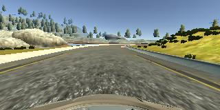

# **Behavioral Cloning** 

## Writeup

---

The goals / steps of this project are the following:
* Use the simulator to collect data of good driving behavior
* Build, a convolution neural network in Keras that predicts steering angles from images
* Train and validate the model with a training and validation set
* Test that the model successfully drives around track one without leaving the road
* Summarize the results with a written report


[//]: # (Image References)


## Rubric Points
### Here I will consider the [rubric points](https://review.udacity.com/#!/rubrics/432/view) individually and describe how I addressed each point in my implementation.  

---
### Files Submitted & Code Quality

#### 1. Submission includes all required files and can be used to run the simulator in autonomous mode

My project includes the following files:
* model.py containing the script to create and train the model
* drive.py for driving the car in autonomous mode
* model.h5 containing a trained convolution neural network 
* video.mp4 2 laps of autonmous driving with model.h5 trained model
* writeup_report.md summarizing the results

#### 2. Submission includes functional code
Using the Udacity provided simulator and my drive.py file, the car can be driven autonomously around the track by executing 
```sh
python drive.py model.h5
```

#### 3. Submission code is usable and readable

The model.py file contains the code for training and saving the convolution neural network. The file shows the pipeline I used for training and validating the model, and it contains comments to explain how the code works.

### Model Architecture and Training Strategy

#### 1. An appropriate model architecture has been employed

I tried to implemente following CNN model from Nvidia (model.py lines 52-78):

| Layer            | Info          													 | 
|:----------------:|:---------------------------------------------------------------:| 
| Convolution2D    | Filters=24, Kernel=(5,5),activation='relu',subsample=(2,2)      | 
| Convolution2D    | Filters=36, Kernel=(5,5),activation='relu',subsample=(2,2)      | 
| Convolution2D    | Filters=48, Kernel=(3,3),activation='relu',subsample=(2,2)      | 
| Convolution2D    | Filters=64, Kernel=(3,3),activation='relu'      				 | 
| Convolution2D    | Filters=64, Kernel=(3,3),activation='relu'     				 | 
| MaxPooling	   | 	size=(2,2)													 | 
| Flatten    	   |	  -   														 | 
| Dense	    	   |	Neurons=100     											 | 
| Dense	    	   |	Neurons=50     												 | 
| Dense	    	   |	Neurons=10     												 | 
| Dense	    	   |	Neurons=1     												 |	 

#### 2. Attempts to reduce overfitting in the model
a. The model was trained and validated on different data sets to ensure that the model was not overfitting. 
   
   I have split the data as: 20% validation set, 80% training set using:
   
   `model.fit(x_train,y_train,validation_split=0.2,nb_epoch=10,shuffle=True)`
   
b. The model was tested by running it through the simulator and ensuring that the vehicle could stay on the track.

c. Reshuffling of the dataset

I also tried adding dropout layers in order to reduce overfitting but generated model didn't worked well. 

#### 3. Model parameter tuning

The model used an adam optimizer, so the learning rate was not tuned manually.

`model.compile(loss='mse',optimizer='adam')`

#### 4. Appropriate training data

Training data was chosen to keep the vehicle driving on the road. I used a combination of center lane driving, recovering from the left/right sides of the road and reverse track driving.

For details about how I created the training data, see the next section. 

### Model Architecture and Training Strategy

#### 1. Solution Design Approach
a. Model:

I wanted to see how well estabished CNN model works. So, I choose NVDIA CNN model to train the netwrok.
But with default model I was not getting proper results for my training set. So I did small modifications in the network after which, I was able to drive the car.

```sh
62 model.add(Convolution2D(48,3,3,subsample=(2,2),activation='relu'))   # reduced the kernel size to save more info
68 model.add(MaxPooling2D())	      #added maxpooling layer after CNN layers	
```

b. dataset:

I choose to use all three camera images i.e. centre, left, right and added correction as follows:

```sh
17  correction = 0.2
24  centre_img_np=cv2.imread(centre_img)                # add centre camera image
    image_list.append(centre_img_np)
    steering_angle_list.append(eval(steering_angle))

    left_img_np=cv2.imread(left_img.strip(' '))         # add left camera image
    image_list.append(left_img_np)
    steering_angle_list.append(eval(steering_angle)+correction)

    right_img_np=cv2.imread(right_img.strip(' '))       # add right camera image
    image_list.append(right_img_np)
34  steering_angle_list.append(eval(steering_angle)-correction)    
```
c. Preprocessing:

As mentioned in the classroom, I used below two ways for preprocessing
```sh
54  model.add(Lambda(lambda x:x/255.0 - 0.5,input_shape=(160,320,3)))   # image normalization
55  model.add(Cropping2D(cropping=((70,20),(0,0))))                     # cropping the image
```

At the end of the process, the vehicle is able to drive autonomously around the track without leaving the road.
Please check video.mp4 for the recorded video.

#### 2. Final Model Architecture

The final model architecture (model.py lines 52-78) consisted of a convolution neural network with the following layers and parameters

| Layer            | Info          													 | 
|:----------------:|:---------------------------------------------------------------:| 
| Convolution2D    | Filters=24, Kernel=(5,5),activation='relu',subsample=(2,2)      | 
| Convolution2D    | Filters=36, Kernel=(5,5),activation='relu',subsample=(2,2)      | 
| Convolution2D    | Filters=48, Kernel=(3,3),activation='relu',subsample=(2,2)      | 
| Convolution2D    | Filters=64, Kernel=(3,3),activation='relu'      				 | 
| Convolution2D    | Filters=64, Kernel=(3,3),activation='relu'     				 | 
| MaxPooling	   | 	size=(2,2)													 | 
| Flatten    	   |	  -   														 | 
| Dense	    	   |	Neurons=100     											 | 
| Dense	    	   |	Neurons=50     												 | 
| Dense	    	   |	Neurons=10     												 | 
| Dense	    	   |	Neurons=1     												 |	 


#### 3. Creation of the Training Set & Training Process
My dataset is created using combination of center lane driving, recovering from the left/right sides of the road and reverse track driving.
I first recorded two laps on track one using center lane driving and one lap by reverse track driving:
Here is example of an center lane driving image:



Training process involved:

a. Data Augmentation:

- I created dataset using all three camera images i.e. centre, left, right and added variance for left & right images.
Here are example of an image using from all three cameras:

Left camera:


Center camera:


Right camera


b. PreProcessing:

- I tried normalizing & cropping the image

```sh
54  model.add(Lambda(lambda x:x/255.0 - 0.5,input_shape=(160,320,3)))   # image normalization
55  model.add(Cropping2D(cropping=((70,20),(0,0))))                     # cropping the image
```

- Then devided the dataset into training & validation dataset

c. Training the network:

- Then I trained the network on training dataset for 10 epoch using 'Adam' optimizer. 

```sh
80 model.compile(loss='mse',optimizer='adam')
81 model.fit(x_train,y_train,validation_split=0.2,nb_epoch=10,shuffle=True)  
```